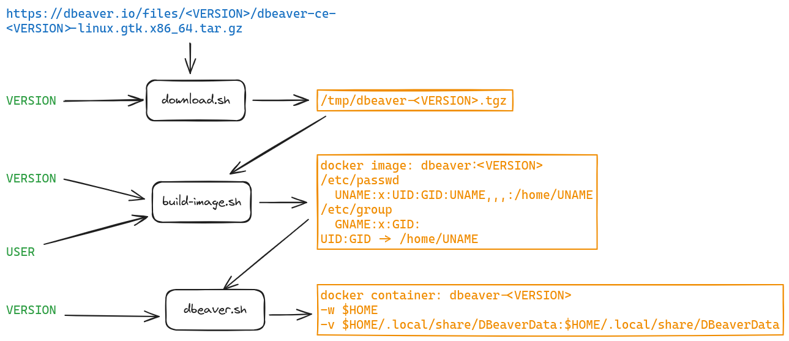

# dbeaver

Runs [dbeaver](https://dbeaver.io/) (cross-platform database tool) as a docker app.

# Copyright

Copyright 2024 Enrico Maschietto &lt;emw7.github.fraying845@simplelogin.com&gt;

## Licensing

dbeaver is licensed under [Apache License 2.0](../LICENSE)

You must consider all files present in https://github.com/emw7/utility/blob/main/dbeaver contains the following text:

<pre>
Copyright 2024 Enrico Maschietto &lt;emw7.github.fraying845@simplelogin.com&gt;

Licensed under the Apache License, Version 2.0 (the "License");
you may not use this file except in compliance with the License.
You may obtain a copy of the License at

    http://www.apache.org/licenses/LICENSE-2.0

Unless required by applicable law or agreed to in writing, software
distributed under the License is distributed on an "AS IS" BASIS,
WITHOUT WARRANTIES OR CONDITIONS OF ANY KIND, either express or implied.
See the License for the specific language governing permissions and
limitations under the License.
</pre>

# ChangeLog

[CHANGELOG](./CHANGELOG)

# Prerequisites

**Note**: the lists below could not be exahustive.

These are the prerequistes for running dbeaver:
- docker

These are the prerequistes needed for installing dbeaver:
- docker

# HOWTO use

First create the image by running:  
```shell
VERSION=24.1.2 ./build-image.sh
```

Versions list can be obtained from [dbeaver archive files](https://dbeaver.io/files/).

If it does not exist, create the directory `$HOME/.local/share/DBeaverData`:
```shell
mkdir -p $HOME/.local/share/DBeaverData
```

Run dbeaver by running (VERSION must match the value used to create the image):
```shell
VERSION=24.1.2 ./dbeaver.sh
```

If it is wanted to run `dbeaver.sh` from any location it is possible copying it to a directory in the user PATH. **Note**: the user PATH and not the system PATH because of some limitations[^1].

# Architecture and design

In this chapter are described the internals of dbeaver that are depicted by the following diagram.

  

dbeaver program is run from a docker image that can be created using `build-image.sh`.  
`build-image.sh` create an image containing the specified version of dbeaver and names it dbeaver:&lt;version&gt;.  
`build-image.sh` depends on the presence of the dbeaver archive in the /tmp directory which name must be dbeaver-&lt;version&gt;.tgz.  
Such an archive can be downloaded by using `download.sh`.  

The Dockerfile used to define the image is designed by considering the following 2 facts:
1. dbeaver is a gui application.
1. it is wanted that different versions of dbeaver (that is different images) can access the same configuration and workspace.

In order to meet the first point the Dockerfile is divided in 3 regions:
1. The first region is common to all gui application (can be reused for either vscode or intellij idea, for example).
1. The second region is common to all dbeaver version.
1. The thirtd region is specific for a dbeaver version.

To satisfy the second point and for the sake of simplicity:
1. `dbeaver.sh` runs the container binding the default dbeaver data directory in the host to a container directory.
1. `build-image.sh` creates the image by adding an user that matches the user that runs the script it self.

The last 2 points above allow to shared user data with instances that are run out of docker but they are a [^1]limitation because:
- Limit the useage of dbeaver to a single user (I guess, as I guess that created images are shared and not owned by a user).
- Force to have dbeaver program data directory on the host even if the user is no using dbeaver program out of docker. See the [TODO](#todo) list for tasks to remeve such a limitations.

# TODO

- Do not use host directory bind volume and switch to docker volume to avoid using host dbeaver workspace directory.
- Allow to use shared workspace, either temporary/volatile workspace or copy of shared workspace for testing new versions
- What about removing build-image.sh and move the image creation in dbeaver.sh as psql does?

# Credits

- [dbeaver](https://dbeaver.io/)
- [Running GUI Applications in a Linux Docker Container](https://www.baeldung.com/linux/docker-container-gui-applications)


